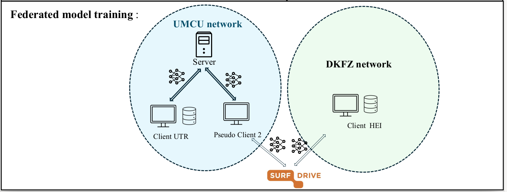

# Federated nnU-Net with NVFLARE and SURFdrive for Pediatric Upper Abdominal OAR Segmentation

This repository describes our implementation of nnU-Net with NVFLARE for the study:

**“Robust organ-at-risk segmentation in pediatric upper abdominal radiotherapy via multicenter federated learning”**

Due to network restrictions and hospital firewall policies, direct communication between all participating sites was not possible. We modified the standard NVFLARE workflow by using **SURFdrive**, a cloud storage service, as an intermediate layer for exchanging model weights.




## Brief Introduction
### Deployment Setup

The federated learning setup was deployed on two machines across two institutional networks. **Machine 1** (UMCU network) hosted the NVFLARE server, the UTR client, and a **pseudo-HEI client**. The real HEI client was deployed on **Machine 2** (DKFZ network). Since the HEI client could not communicate directly with the server, the pseudo-HEI client acted as an intermediary via SURFdrive, exchanging model weights using the [**WebDAV protocol**](https://servicedesk.surf.nl/wiki/spaces/WIKI/pages/126222571/RD+Uploading+files+to+a+Public+link). This design avoids direct cross-institutional network communication and is straightforward to scale to additional clients.

### Training Workflow

Both clients start from the same initialized global model. Each federated learning round proceeds as follows:

1. Before training starts, the initialized global model is shared with both sites, and each site begins local training from this model.
2. The UTR client trains the model locally and sends the updated weights directly to the server.
3. The real HEI client trains the model locally and uploads its updated weights to SURFdrive. The pseudo-HEI client then downloads these weights from SURFdrive and forwards them to the server.
4. The server aggregates the updates from both clients using FedAvg and distributes the new global model.
5. The UTR client receives the updated global model directly from the server. The pseudo-HEI client receives the updated global model from the server and uploads it to SURFdrive, where the real HEI client downloads it to continue the next round.

## Implementation

### Prerequisites

Both machines use the same environment setup for nnuent:

**Machine 1** — Server, UTR client, and pseudo-HEI client  
**Machine 2** — Real HEI client

```bash
uv venv fed_abdped --python 3.10
source fed_abdped/bin/activate
uv pip install torch==2.6.0+cu118 torchvision torchaudio \
  --index-url https://download.pytorch.org/whl/cu118
# Machine 1:
uv pip install nvflare==2.5.2 nnunetv2==2.6.0
# Machine 2:
# The real HEI client does not run inside the NVFLARE framework,
# so installing NVFLARE is not required.
uv pip install nnunetv2==2.6.0
```


### Prepare and Preprocess the Training Dataset into [nnUNet](https://github.com/mic-dkfz/nnunet) Format

All clients with local data must be preprocessed using the same plan. In this study we use `PlansCombined`:

```bash
nnUNetv2_plan_and_preprocess -d 201 --verify_dataset_integrity -c 3d_fullres -tr PlansCombined
```

After planning, initialize one model from this plan and share it with all clients as the starting point for the first federated round.


### Run Federated Learning with NVFLARE

#### Provision

Generate the secure startup packages for the server, clients, and admin:

```bash
nvflare provision -p ./secure_project.yml
```

The configuration in `secure_project.yml` is adapted from the official NVFLARE [**CIFAR-10 real-world example**](https://github.com/NVIDIA/NVFlare/tree/main/examples/advanced/cifar10/pt/cifar10-real-world), with minimal changes to configure one server, two clients, and one admin.

This generates a `workspace/` directory:

```text
workspace/
└── fed_abdped
    ├── prod_00
    │   ├── admin@nvidia.com
    │   │   ├── local
    │   │   ├── startup
    │   │   └── transfer
    │   ├── hostname
    │   │   ├── local
    │   │   ├── startup
    │   │   └── transfer
    │   ├── site-1
    │   │   ├── local
    │   │   ├── startup
    │   │   └── transfer
    │   └── site-2
    │       ├── local
    │       ├── startup
    │       └── transfer
    ├── resources
    └── state
```

If all sites can communicate directly (no firewall), replace each site and server name with the corresponding IP address or hostname (`hostname -f`), then distribute each site folder to the appropriate machine.

Copy the `jobs/` folder to Machine 1, and copy `jobs/job_real_site-2/` to Machine 2. Examples of Jobs can also be generated via: `nvflare job create`

For more details on job definitions, see the `./jobs` folder.


#### Start Connection

On Machine 1, open a separate terminal for each site (server, site-1, site-2) and start each:

```bash
cd workspace/fed_abdped/prod_00/server/startup/
bash start.sh
```

#### Submit the Job — Machine 1

Use the FLARE API via the admin site to connect to the federation and submit the training job. Open and follow `run_task.ipynb`.
Training will begin. Progress can be monitored via `run_task.ipynb`.
#### Start the Task — Machine 2

On Machine 2, run:

```bash
python ./jobs/job_real_site-2/run_client_utr_fl_aug_1000epochs.py
```


## Quick Summary for Machine 1 and Machine 2

**Machine 1: NVFLARE server, UTR client, and pseudo-HEI client**

Machine 1 has both NVFLARE and nnU-Net installed. The local dataset is prepared and preprocessed in the nnU-Net format. The `./jobs` folder is copied to this machine, and the server and clients are provisioned. After connecting to the NVFLARE workspace, the federated learning task is started through the NVFLARE admin API or admin console.

**Machine 2 or additional real client machines**

Machine 2, or any additional real client machine, has nnU-Net installed and the local dataset prepared and preprocessed in the nnU-Net format. The initialized global model is received before training starts. The real-site job folder, for example `./jobs/job_real_site-2`, is copied to the machine and run locally to train the model and exchange weights through SURFdrive.

## Citation

If you use this repository, please cite our preprint:

```bibtex
@misc{ding2026overcoming,
  title         = {Robust organ-at-risk segmentation in pediatric upper abdominal radiotherapy via multicenter federated learning},
  author        = {Ding, Mianyong and Knoll, Maximilian and Harrabi, Semi and van Grotel, Martine and Littooij, Annemieke S. and van Noesel, Max and Schenk, Jens-Peter and van den Heuvel-Eibrink, Marry M. and Janssens, Geert O. and Maspero, Matteo},
  year          = {2026},
  eprint        = {to be added},
  archivePrefix = {arXiv},
  primaryClass  = {eess.IV}
}
